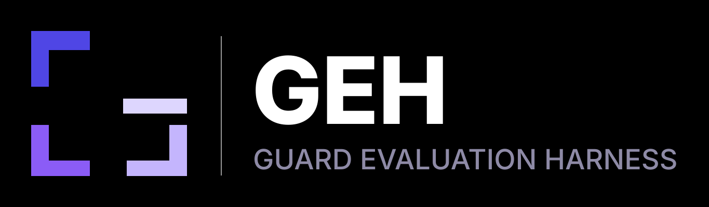
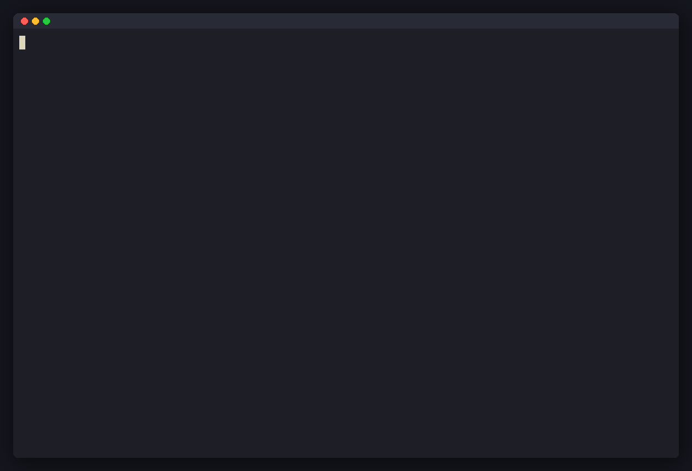

<p align="center">
  
</p>

<p align="center">CLI-first harness for benchmarking guardrail, moderation, and safety classification models.</p>

<p align="center">
  
</p>

<p align="center">
  <a href="https://pypi.org/project/geh/"></a>
  <a href="https://pypi.org/project/geh/"></a>
  <a href="https://github.com/Virtue-Research/guard-eval-harness/blob/main/LICENSE"></a>
  <a href="https://github.com/Virtue-Research/guard-eval-harness/actions/workflows/ci.yml"></a>
  <a href="https://virtue-research.github.io/guard-eval-harness/"></a>
  <a href="https://pepy.tech/projects/geh"></a>
  
</p>

Evaluate any safety model — local HuggingFace, vLLM, OpenAI, Anthropic, or custom API — against 80+ built-in safety benchmarks with a single command.

## Quickstart

```bash
pip install geh

# Run a quick eval
geh run --dataset xstest --model mock --limit 50

# Run multiple datasets
geh run --dataset xstest,toxic_chat,harmful_qa --model hf \
    --model-name meta-llama/Llama-Guard-3-8B

# Run from a YAML config
geh run --config examples/run-mock-jsonl.yaml

# Use benchmark packs
geh run --pack core --model mock
```

## Installation

Requires Python 3.10+.

```bash
# Base install
pip install geh

# With HuggingFace model support
pip install "geh[hf]"

# With vLLM support
pip install "geh[vllm]"

# With API model support (OpenAI, Anthropic)
pip install "geh[api]"
```

From source (for development):

```bash
git clone https://github.com/Virtue-Research/guard-eval-harness.git
cd guard-eval-harness
pip install -e ".[dev]"
```

Copy `.env.example` to `.env` and fill in the API keys you need.

## Usage

### Inline mode

The fastest way to run evals — no config files needed:

```bash
geh run --dataset <dataset> --model <adapter> [--model-name <name>] [options]
```

```bash
# HuggingFace model on XSTest
geh run --dataset xstest --model hf --model-name meta-llama/Llama-Guard-3-8B

# OpenAI moderation
geh run --dataset xstest,toxic_chat --model openai_moderation

# vLLM serving
geh run --dataset harmbench_behaviors --model vllm \
    --model-name meta-llama/Llama-Guard-3-8B --batch-size 32

# Limit samples for quick smoke tests
geh run --dataset xstest --model mock --limit 10
```

### YAML config mode

For full control over model args, dataset options, execution tuning, and output:

```bash
geh run --config examples/run-mock-jsonl.yaml
```

See [`examples/`](examples/) for sample configs.

### Benchmark packs

Curated dataset bundles for common evaluation scenarios:

```bash
geh list packs
geh run --pack core --model mock
geh run --pack jailbreak --model hf --model-name meta-llama/Llama-Guard-3-8B
```

### Discovery

```bash
geh list datasets    # 80+ built-in safety benchmarks
geh list backends    # Available model adapters
geh list packs       # Curated benchmark bundles
geh list metrics     # Supported metrics
```

### Inspecting results

```bash
geh inspect --run-dir out/my-run       # View manifest, summary, artifacts
geh report --run-dir out/my-run        # Rebuild HTML report
geh compare --run-a out/run1 --run-b out/run2  # Diff two runs
geh export --run-dir out/my-run --format csv --output results.csv
```

## Run artifacts

Each run writes a self-contained directory:

```
out/my-run/
  manifest.json              # Run metadata
  resolved-config.json       # Exact config snapshot
  summary.json               # Aggregated metrics
  report.html                # Static HTML report
  datasets/
    <dataset>/
      predictions.jsonl      # Per-sample predictions
      metrics.json           # Dataset-level metrics
      dataset-manifest.json  # Dataset metadata
```

## Model adapters

| Adapter | Description |
|---------|-------------|
| `mock` | Deterministic mock for testing |
| `hf` | HuggingFace Transformers (local GPU) |
| `vllm` | vLLM inference server |
| `openai_compatible` | OpenAI-compatible APIs |
| `openai_moderation` | OpenAI Moderation endpoint |
| `anthropic` | Anthropic Claude API |
| `http` | Generic HTTP endpoint |

## Datasets

80+ built-in safety benchmarks spanning two modalities:

### Text

The core modality — evaluate text-based guardrails and moderation models across a range of safety dimensions:

- **Jailbreak / adversarial**: XSTest, HarmBench, JBB Behaviors, AdvBench, Do-Anything-Now, StrongREJECT, MaliciousInstruct, WildGuardMix
- **Toxicity**: ToxicChat, ToxiGen, Jigsaw Toxicity, Civil Comments, RealToxicityPrompts, OR-Bench
- **Hate & harassment**: HateCheck, DynaHate, ETHOS, HatExplain, Implicit Hate, Measuring Hate Speech, Social Bias Frames, ConvAbuse
- **General safety**: BeaverTails 330k, Do-Not-Answer, OpenAI Moderation (via API), GuardBench, CircleGuardBench
- **Prompt injection**: Dedicated prompt-injection benchmarks for testing input-filtering guardrails

### Image

Evaluate multimodal safety models that process image+text inputs. The harness handles image downloading, caching, and normalization automatically:

- **Unsafe content detection**: UnsafeBench (8k+ images across safety categories), HoliSafeBench (holistic image safety with fine-grained risk types)
- **Visual jailbreaks**: JailbreakV (adversarial images designed to bypass vision-language model safeguards)
- **Image edit safety**: Safe-vs-Unsafe Image Edits (detecting harmful image manipulation requests)
- **Cross-modal attacks**: VLSBench, MSTS (text+image multimodal safety evaluation)
- **Benign baselines**: ImageNet-1k safe subset (measuring false positive rates on benign images)
- **Local image data**: Load from local directories or JSONL manifests with image paths/URLs

### Local files

Bring your own data in any modality:

- `local_jsonl` — text samples from a JSONL file
- `local_csv` — text samples from a CSV file
- `local_image_jsonl` — image+text samples from a JSONL manifest with image paths/URLs
- `local_image_dir` — image samples from a directory of images

Run `geh list datasets` for the full list.

## About

`guard-eval-harness` is built and maintained by the research team at
**[Virtue AI](https://www.virtueai.com)** — one security solution for your entire AI stack.

## License

[MIT](LICENSE)
